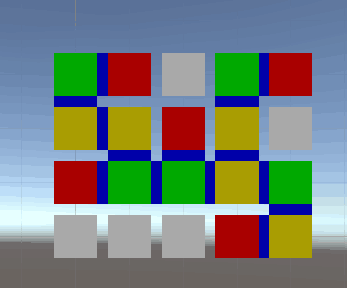
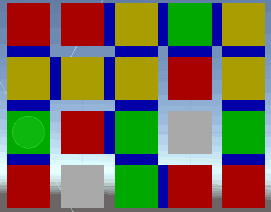

# RandomMap

在指定的 Width 和 Height 下， 要求有M个不能相连的房间， 并串联房间生成一副迷宫地图。

### 思路
 * 1, 首先生成 M 个房间， 要求是房间位置随机， 房间之间的距离（Math.Abs(x) + Math.Abs(y)）不小于 Density。可指定随机次数，在次数内检测位置是否满足，一直未随机到就按顺序找一个空位置。
 * 2, 生成 N 个野外连接点，方法同上
 * 3, 分别找到每个房间与其最近的一个连接点，做随机连接，中间产生的空白点标记为Path，此处我是用AStar
 * 4, 删除多余未使用的连接点
 * 5, 遍历连接点，测试每个连接点是否能相互连通，优先使用连接点和已存在路径测试， 不行则使用连接点+已存在路径+空白点， 路径中产生的空白的同样标记为路径点

### 效果图

图中红色为房间、绿色为连接点、黄色为路径点， 蓝色表示两个有颜色的格子只有通过此才能连接

  